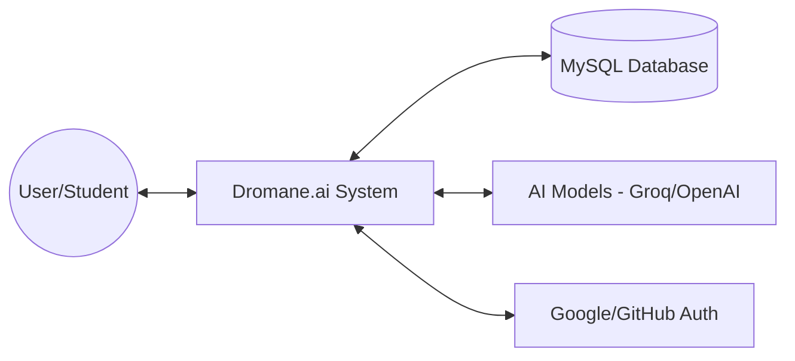
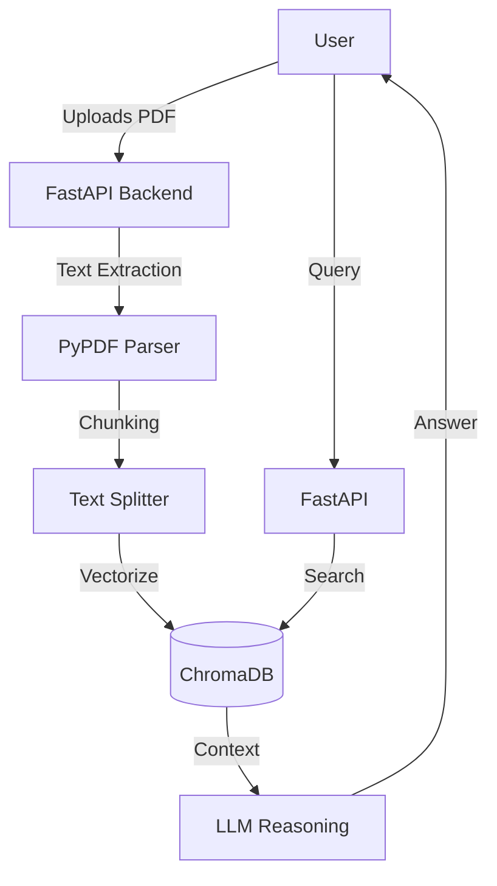
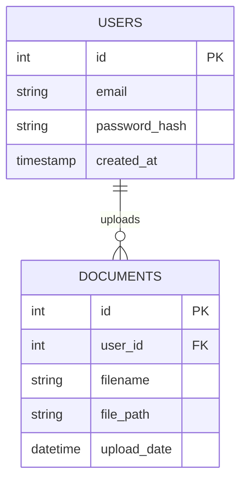
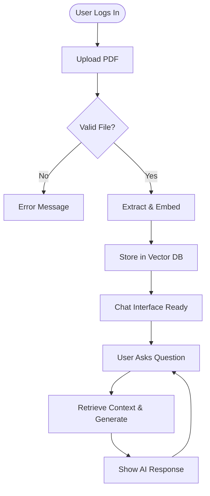

# System Analysis Report: Dromane.ai

## 1. Introduction / Background
**Dromane.ai** is a next-generation "Research & Code Hub" developed to bridge the gap between academic requirements and modern artificial intelligence. In a landscape where students and researchers are overwhelmed by dense technical documentation and complex codebases, Dromane.ai provides an integrated environment for document intelligence, algorithmic analysis, and comprehensive web research.

The platform is built on a **Hybrid Microservices Architecture**, utilizing **PHP 8.x** for secure identity management (meeting academic standards) and **Python (FastAPI)** to orchestrate advanced RAG (Retrieval-Augmented Generation) pipelines.

## 2. Problem Statement
Traditional methods of academic research and code comprehension are plagued by:
- **Information Overload:** Students struggle to extract key insights from lengthy academic PDFs.
- **Context Switching:** Users have to switch between multiple tools (ChatGPT, Google, Code Debuggers) to complete a single task.
- **Complexity in Code Learning:** Static code documentation often fails to explain logic in a personalized, conversational manner.
- **Security & Multi-stack Integration:** Modern AI applications often lack robust, traditional authentication frameworks required for university-level deployments.

## 3. Objectives
The primary objectives of the Dromane.ai project are:
- **Secure Integration:** Implement a hybrid authentication system issuing JWTs via PHP to be consumed by a Python-based AI engine.
- **Intelligent RAG Pipeline:** Build a robust retrieval system using ChromaDB and OpenAI/Groq models for accurate document-based Q&A.
- **User-Centric Hub:** Develop a centralized dashboard containing tools for summarizing, humanizing text, and analyzing code.
- **High-Performance UI:** Deliver a "Wowing" user experience using React 18, Tailwind CSS, and Framer Motion for premium aesthetics and fluidity.

## 4. Scope of the Project

### Participant Side:
- **Identity Management:** Secure registration, login, and profile management with OAuth (Google/GitHub) support.
- **AI Hub Access:** Interactive suite of tools including PDF Chat, Code Analyzer, Text Humanizer, and Research Assistant.
- **Document Management:** Personal storage for uploaded research papers with real-time processing indicators.
- **Natural Language Interaction:** Seamless chat interface with streaming responses for immediate feedback.

### Organizer (Admin) Side:
- **User Management Oversight:** Ability to monitor active users and manage account status.
- **System Health Monitoring:** Dashboard showing AI API usage, database connectivity, and server status.
- **Document Metadata Control:** View and manage metadata of all processed documents within the RAG ecosystem.
- **Usage Analytics:** Track popular features to guide future development iterations.

### Design Focus:
- **Aesthetics:** Vibrant color palette (Dromane Orange `#F15025`), Space Grotesk typography, and dark-mode compatible glassmorphism.
- **Interactivity:** Micro-animations (hover effects, skeleton loaders), motion-responsive background gradients, and real-time form validation.
- **Responsiveness:** Mobile-first design approach ensuring 100% functionality on smartphones, tablets, and wide-screen monitors.

## 5. Expected Deliverables

### Design Diagrams (Mapping the Architecture)

#### Context Diagram


#### Data Flow Diagram (DFD - Level 1)


#### Entity Relationship Diagram (ERD)


#### Use Case Diagram
```mermaid
usecase
    actor "Student" as S
    actor "Admin" as A
    
    package Dromane.ai {
        usecase "Upload & Chat with PDF" as UC1
        usecase "Analyze Code Logic" as UC2
        usecase "User Authentication" as UC3
        usecase "Manage User Accounts" as UC4
        usecase "System Metrics Monitor" as UC5
    }
    
    S --> UC1
    S --> UC2
    S --> UC3
    A --> UC4
    A --> UC5
```

#### System Flowchart (PDF Chat Logic)


### Working Prototype (The Software)
- **Web-based Registration Form:** Interactive React components utilizing `framer-motion` for transitions and real-time field validation with `zod`.
- **Admin Dashboard:** A streamlined interface for system administrators to oversee platform operations and resource utilization.

## 6. Feasibility Report
- **Technical Feasibility:** The chosen stack (React + PHP + Python) is highly mature. Using ChromaDB for local vector storage ensures speed and data privacy without external dependency costs.
- **Economic Feasibility:** Leveraging `gpt-4o-mini` and Groq API (local Llama-3) provides high-level reasoning capabilities at a fraction of the cost of traditional dedicated AI servers.
- **Operational Feasibility:** The intuitive interface significantly reduces the learning curve for non-technical students, making it a viable tool for university-wide adoption.
